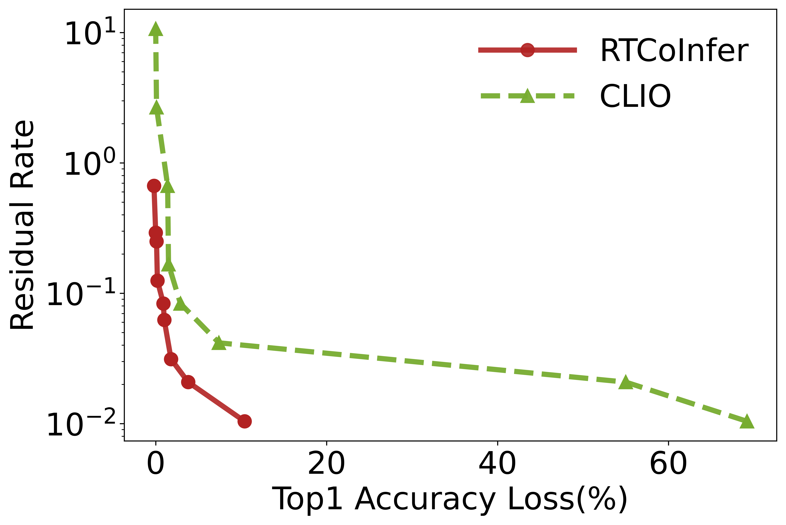

# CLIO: Enabling automatic compilation of deep learning pipelines across IoT and Cloud

Clio, a novel model compilation framework that provides a continuum of options for deep learning models to be partitioned across a low-power IoT device and the cloud while gracefully degrading performance in the presence of limited and dynamic resources. Clio achieves this by combining the idea of partitioning a deep learning model together with progressive transmission of intermediate results --- put together, these techniques can deal with both resource constraints and resource dynamics. Importantly, Clio integrates progressive transmission with model compression and adaptive partitioning in response to wireless dynamics. By doing so, Clio significantly expands the possible endpoints for model compilation for IoT-cloud networks.

One of the key benefits of Clio is that it allows model compilation techniques to be used even for stringently resource-constrained IoT devices which may have orders of magnitude less resources than the original model requires. By fully utilizing available bandwidth for remote execution, Clio limits the portion of the original model that needs to be compiled to the resource-constrained device thereby reducing the extent of compression that is required. This has significant advantages from a deployment perspective --- rather than having to hand-tune a model for deployment, automatic model compilation allows us to easily deploy large models over resource-limited networks of devices.
# Overview

<div align="center">

  

</div>


Clio is a model compilation technique that allows us to execute large state-of-art models over resource-constrained IoT networks while gracefully degrading performance in the face of uncertain wireless bandwidth. At the core of Clio is a joint IoT-cloud optimization technique for progressively transmitting intermediate results from a partitioned model in-order to deal with bandwidth variations.

## Progressive Slicing

<div align="center">

  

</div>
<!--  -->

We illustrate progressive slicing with the example . Here, the IoT device executes the initial layers until layer 3, and the rest of the pipeline is executed at the cloud. In this example, the output of layer 3 is partitioned into three slices, and depending on the bandwidth, different number of slices are transmitted to the cloud. There are three corresponding versions of layers on the cloud to handle the three possible slices as input. During inference time, IoT devices will execute layers `1-3` locally and pass the intermediate result of layer `3` to radios for transmission. Due to network dynamics, radios will send as much as possible and the cloud will activate the corresponding path for the received progressively sliced intermediate results. 

# Training and Usage

## Train
The training of the Clio could be done by running
``` 
python train_clio.py app:'apps/train_clio.yml'
```
## Test

Test the model:
```
python test_clio.py app:'apps/test_clio.yml'
```

## Usage
The deployment of Clio is to deploy the partition models into IoT devices and Cloud. The deployment of the deep learning models on IoT devices is specific for different devices. For GAP8, We use the suggested way to deploy the deep learning models by Greenwaves Technologies. Co. LTD. You could find the instructions to deploy deep learning models on IoT devices at [GAP Flow 1.2.pdf](https://github.com/jinhuang01/CLIO/files/5011660/GAP.Flow.1.2.pdf).


It is worth noting that CLIO consumes a similar local computation resource like RTCoInfer to compress the uploading data, and the comparison between CLIO and RTCoInfer under various accuracy loss constraints is illustrated in the following figure. The residual rate equals the average uploading data size over the original image size.

<div align="center">

  

</div>
<!--  -->

Obviously, RTCoInfer achieves a lower residual rate under the same accuracy loss constraint, thus RTCoInfer achieves larger throughputs with the same devices and network conditions.

