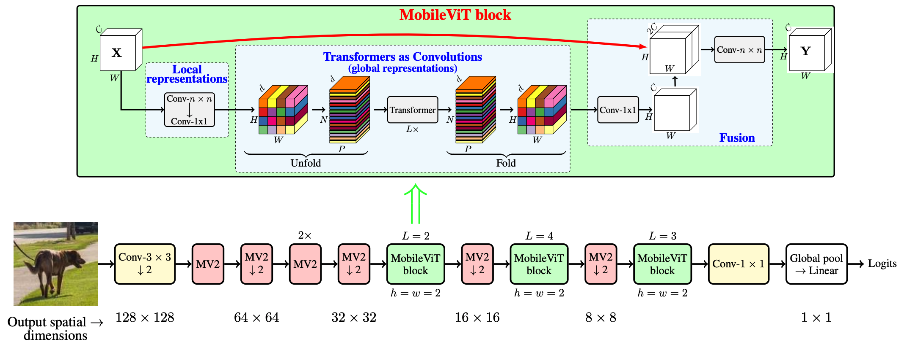
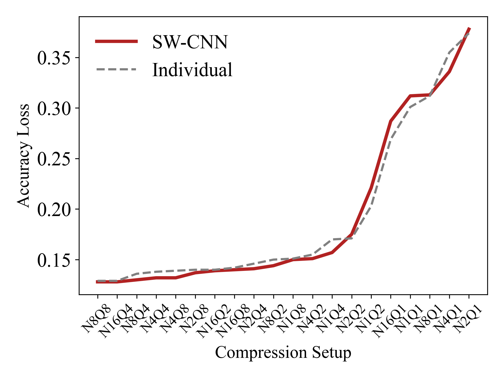
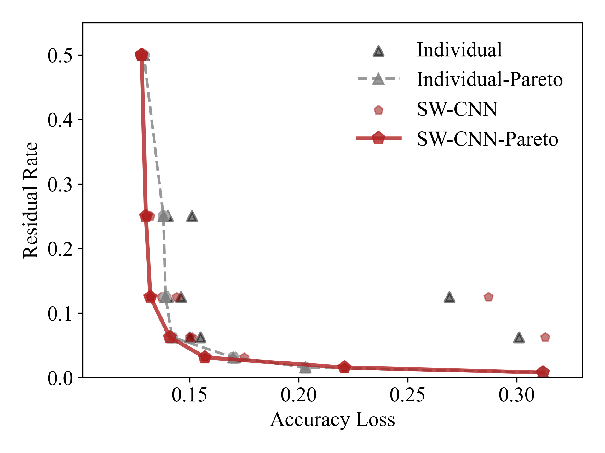

# MobileViT: Light-weight, General-purpose, and Mobile-friendly Vision Transformer

The implementation of paper : MobileViT: Light-weight, General-purpose, and Mobile-friendly Vision Transformer.

<div align="center">


</div>

## Data Resource
* Experiments are running on the dataset StanfordCars
* You may follow the data preparation guide [here](https://ai.stanford.edu/~jkrause/cars/car_dataset.html).
  
## Model Structure
View the model structure
```
./vitmodel.txt
```


## Running the experiments
* Train the model
```
add the configuration "test_only: False" in apps/sw_mobilevit.yml
python swcnn_train.py app:apps/sw_mobilevit.yml
```
* Test the model
```
add the configuration "test_only: True" in apps/sw_mobilevit.yml
python swcnn_train.py app:apps/sw_mobilevit.yml
```
and you can see the results in test_database.txt

## Performance verification with switchable training weights
The performance of the switchable training weights is similar to the performance of the separately trained weights.

You can download the individually trained weights by clicking on [this link](https://drive.google.com/drive/folders/1OpOKmq9NlQYfVdYPRbQ2FX-XURvnZQCW?usp=sharing).

<div align="center">

<!--  -->
</div>

After putting them under the current folder, you can test the performance of the downloaded weights with the following command.
```
python exp_test.py
```

## Pareto Curve

<div align="center">

</div>
<!--  -->