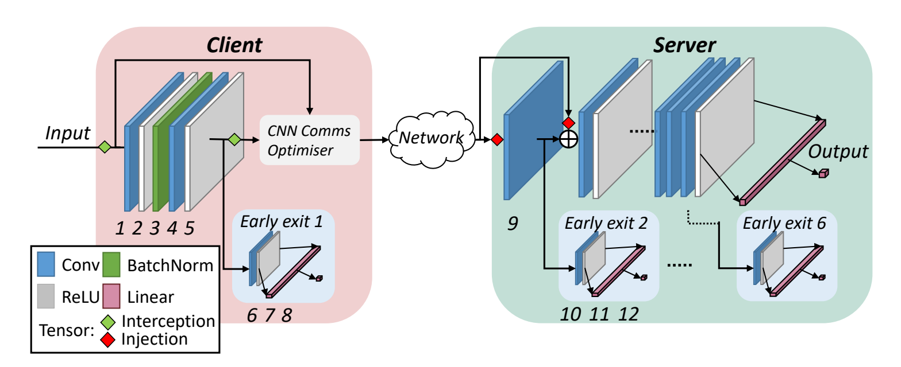
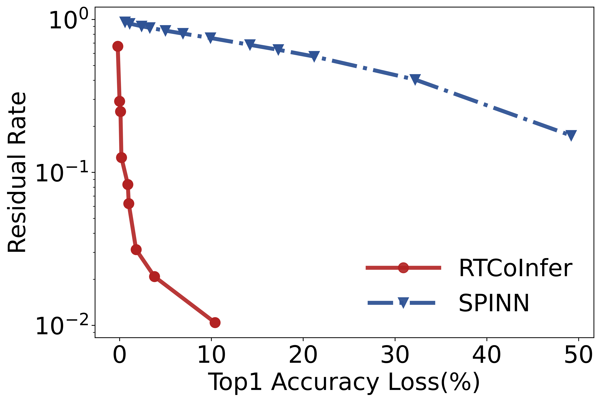

# SPINN: synergistic progressive inference of neural networks over device and cloud

The implementation of paper : SPINN: synergistic progressive inference of neural networks over device and cloud.

<!-- <div align="center">

  

</div> -->


## Data Resource
* Experiments are running on the dataset StanfordCars
* You may follow the data preparation guide [here](https://ai.stanford.edu/~jkrause/cars/car_dataset.html).
  
## Model Structure
View the model structure
```
./model.txt
```

## Running the experiments
* Train the model
```
python train.py app:'./apps/train_us_mobilenet_v2_train_val.yml'
```
* Test the model with the user-defined confidence_threshold
```
python test.py app:'./apps/test_us_mobilenet_v2_train_val.yml'
```
* Change the test confidence threshold
```
add the configuration "z_confidence_threshold: {number_you_want}" in test_us_mobilenet_v2_train_val.yml
```
The user-defined confidence_threshold controls the early-exit rate of the progressive model, which determines the uploading rate of input images and the average consumption of network bandwidth.
The following table gives the impact of user-defined confidence_threshold.

<div align="center">

|Confidence-Threshold|Uploading-Rate|Average-Inference-Accuracy|
|:---------:|:-----:|:-----:|
|0.700|0.960|0.166|
|0.600|0.939|0.171|
|0.500|0.902|0.184|
|0.460|0.881|0.193|
|0.400|0.844|0.210|
|0.350|0.808|0.229|
|0.300|0.756|0.259|
|0.250|0.902|0.302|
|0.225|0.633|0.333|
|0.200|0.572|0.372|
|0.150|0.404|0.482|
|0.100|0.174|0.652|
</div>


It is worth noting that SPINN can consume a similar local computation resource like RTCoInfer to compress the uploading data, and the comparison between SPINN and RTCoInfer under various accuracy loss constraints is illustrated in the following figure. The residual rate equals the average uploading data size over the original image size. 

<div align="center">

  

</div>


<!--  -->

		
